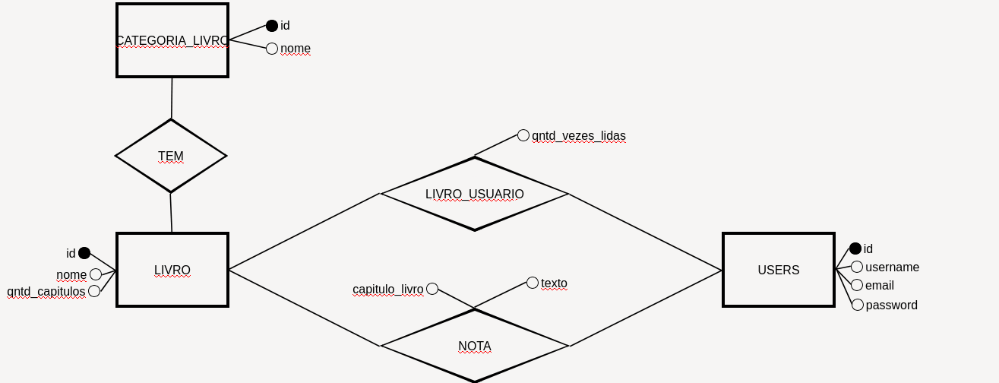

# Bíblia Anotada

A proposta deste projeto é auxiliar na leitura da Bíblia Sagrada, permitindo que o usuário mantenha o controle do número
de vezes que leu cada livro, e baseado nisso, a quantidade de vezes que leu a Bíblia inteira. É possível, também,
adicionar uma nota de texto a um capítulo específico. Todas essas informações serão salvas numa base de dados externa,
ficando associadas a uma conta específica, permitindo, então, que os usuários acessem seus dados de qualquer
dispositivo. Além disso, o usuário poderá adicionar um marcador a um livro específico, para não se perder na sua rotina
de leitura. O marcador ficará associado somente a um livro e salvará o número do último capítulo lido. Também não será
no banco, apenas no dispositivo atual do usuário.

## Fluxo de Uso:

Ao iniciar o programa, os usuários serão redirecionados automaticamente a página de login/cadastro. É necessário que
todos os usuários criem uma conta para poderem utilizar as funcionalidades do programa. Após criar uma conta ou efetuar
login, os usuários são enviados à página principal do programa, nesta página, haverá duas guias principais, uma para
cada testamento, para haver uma melhor organização do layout. Cada guia será composta por uma tabela, composta pelas
seguintes colunas: nome do livro, quantidade de capítulos e quantidade de vezes lidas. Nas duas últimas colunas, haverá
dois botões, um para aumentar e outro para diminuir o total de leituras realizadas daquele seguinte livro.

No rodapé das guias, será mostrado a quantidade de vezes que aquele usuário leu a Bíblia inteira. Nessa página haverá
também outros três botões. O primeiro para o usuário sair da sua conta, ou seja, fazer logout, o segundo para acessar o
seu perfil, onde ele poderá alterar as suas informações de cadastro e, por fim, o terceiro botão para acessar a lista de
todos os usuários do programa.

Na página de perfil, o usuário poderá apagar a sua conta e alterar as suas informações. Se o usuário realmente deseja
apagar o seu cadastro, ele deve confirmar a sua escolha mediante uma caixa de diálogo mostrada pelo navegador, após
isso, ele será redirecionado à página de login/cadastro. Senão, nenhuma ação será realizada. Para alterar a sua senha o
usuário precisa inserir a sua senha atual, e depois, criar uma nova senha conforme as regras do programa.

Já, na página de listagem dos usuários, será possível ver todos os usuários do programa, vendo seus nomes de usuários e
e-mails. Ao lado de cada usuário haverá um botão que permitirá mandar um e-mail para ele.

## Modelo da Bíblia:

O modelo da Bíblia será decidido na configuração do programa. Haverá um seeder dedicado para a implantação de cada
modelo, sendo possível escolher entre um deles. O resto da funcionalidade do programa independe do modelo de Bíblia
escolhido.

## Base de Dados:

O relacionamento entre categoria_livro e livro é 1:N(Um livro, pertence a uma, e somente uma, categoria).

O relacionamento livro_usuario é N:N(Um usuário pode ler vários livros, e um livro pode ser lido por vários usuários).

O relacionamento nota é N:N(Os usuários podem criar notas em quaisquer livros sem limite de quantidade).
